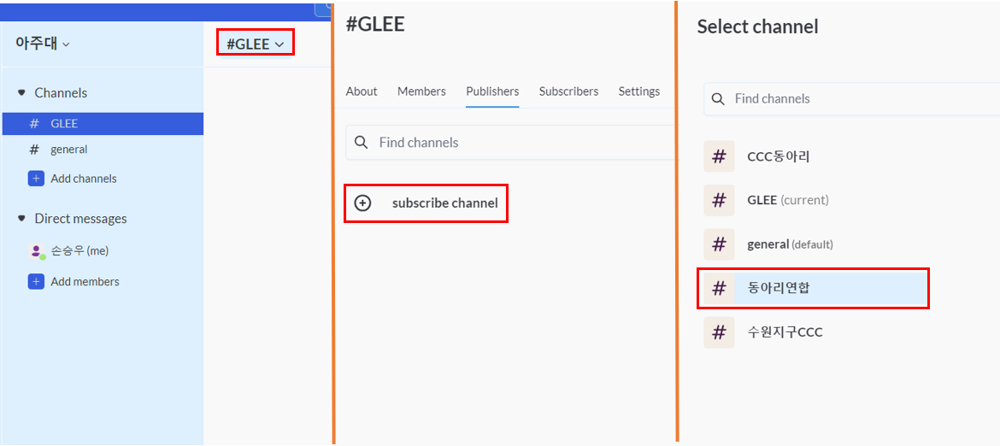
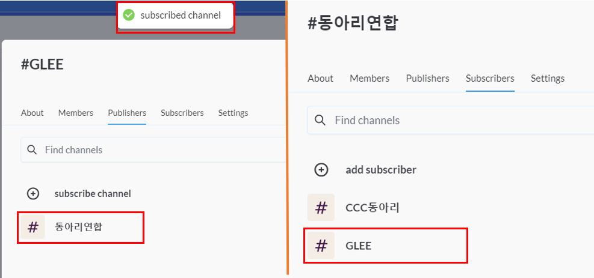
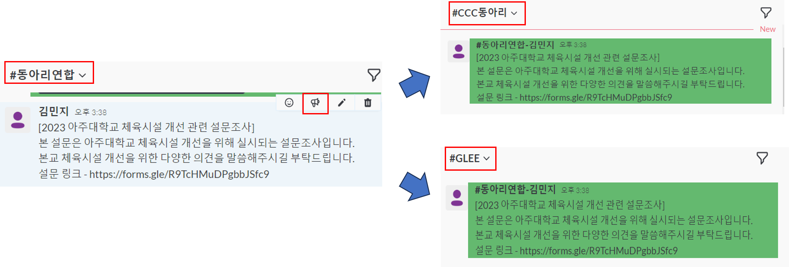
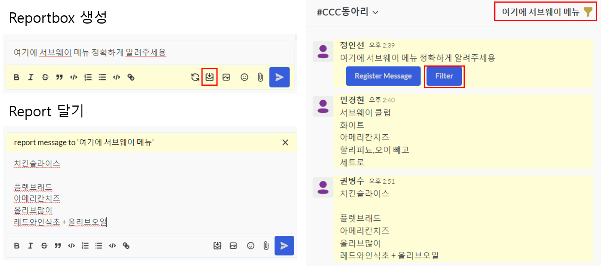
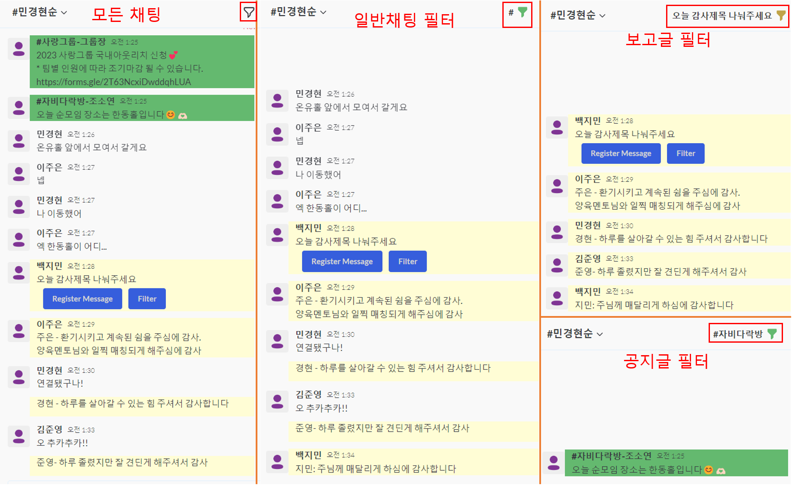
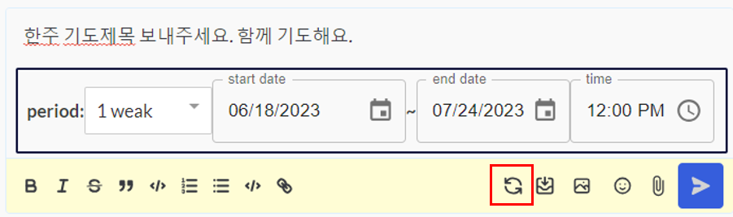

## Overview

ShareMessenger aims to provide a convenient sharing function by reflecting the structure of a community in the chat system. In this project, the chat system establishes a notification relationship between chat rooms with the subscribe function between chat rooms. It implements a notification function between chat rooms that transmits notification messages, a reporting function that induces sharing among chat room members, and a filtering function that shows messages according to message types.

## Web Installation

You can install ShareMessenger on any servers (Windows, Linux or macOS), by using Docker. Just download the Docker Compose file to your computer and initiate the process.

```
curl -o docker-compose.yml https://github.com/enjoeyland/ShareMessenger/docker-compose.yml


docker-compose up -d
```

## Subscribe Feature




## Announcement Feature



## Report Feature



## Report Feature



## Schedular Feature


